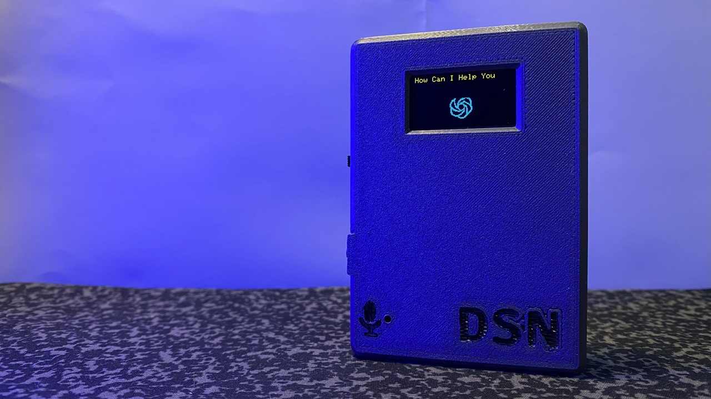
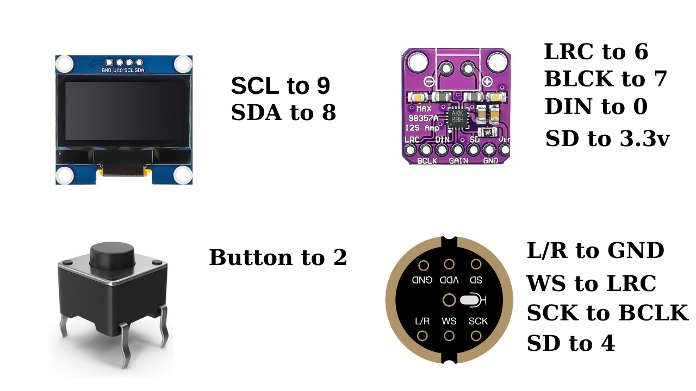

🧠 Dsn AI Voice Assistant v2
⚡ Much More Responsive, Brilliant, and Portable.

 
🎬 Introduction

Hey everyone 👋
Welcome to the second generation of my ESP32-based AI Voice Assistant — now faster, smarter, and more portable than ever!
 
Your support helps this project grow ❤️

Didn’t see the first version yet? Watch it here on YouTube.

It includes full server setup, installation, and configuration steps.

> Don't forget to **Subscribe** to the [Channel](https://www.youtube.com/dsnmechanics/?sub_confirmation=1) and **Like** the video!

🎥 Watch the full build video here:

The AI model runs on Hugging Face, while the ESP32-C3 works as a client handling voice input and real-time AI audio response.

⚙️ Features at a Glance

✅ Real-time AI voice responses
✅ WAV streaming playback (no SPIFFS delay)
✅ Hugging Face cloud AI integration
✅ Compact SSD1306 OLED for info display
✅ Optimized GPIO & RAM usage for ESP32-C3
✅ Portable 3D-printed enclosure
✅ Designed with Fusion 360

🧩 Components Used
Component	Description
ESP32-C3	Main controller (any dev board works)
INMP441	I2S MEMS microphone
MAX98357A	I2S audio amplifier
SSD1306	OLED display (I²C)

⚠️ Note: ESP32-C3 has fewer GPIO pins and less SRAM.
The I2S devices share the same pins except for DIN and DOUT.
MAX98357A’s SD pin is tied to 3.3V to stay always ON.

📸 Connection Diagram:

💻 Software Overview

In the first version, ESP32 downloaded MP3 audio files and played them from SPIFFS.
Now in v2:

🚀 Streams WAV audio directly from server
🎧 Instant playback — no file delay
🌍 Web-connected AI using Hugging Face
🗣️ Button-based activation (hands-free version coming soon)
🖥️ 2-pin OLED keeps things lightweight

🧠 Version Comparison
Feature	v1	v2
Audio Format	MP3 (downloaded)	WAV (streamed)
Response Speed	Slow	Instant
AI Model	Local	Hugging Face
Connectivity	Offline	Web-based
Display	TFT	OLED
Activation	Button	Button / Planned Voice Wake
🧰 Setup & Installation
🔧 1. Hardware Setup

Connect the components as shown in the wiring diagram.
Keep I2S lines short for minimal noise.
 

🧠 Tip: Keep a stable Wi-Fi connection for the best experience.

🧱 3D Printed Enclosure
Designed with Fusion 360 for compactness and portability.

📦 Download the STL: 
[Cults3D - Dsn AI Assistant Shell](https://cults3d.com/en/3d-model/tool/dsn-ai-assistant-3d-model)

💖 Support the Project
Help me keep building open-source AI projects 🧠💡

💖 Support on [Patreon](https://www.patreon.com/posts/esp32-based-ai-142318639)
Get early access, exclusive projects, and behind-the-scenes updates. 

🗺️ Future Plans

✨ Hands-free voice activation
🔋 Battery-powered portable version
🎨 Animated OLED interface
📡 Improved audio noise cancellation

👨‍🔬 Dsn Industries
Embedded Systems | AI | ESP32 | 3D Design

🌐 GitHub
 • YouTube
 • Patreon
 • Cults3D
 • Hugging Face

📜 License

Licensed under the  GPL-3.0 license

💬 Comment your ideas below — what should I build next?
See you in the next project 🚀
